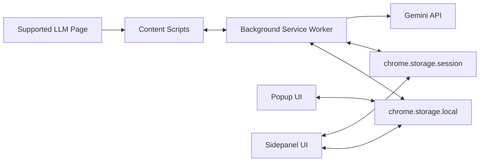

# Promptium Architecture

## Runtime Overview

## Main Surfaces

### Content scripts (`content/`)

- Platform detection and boot (`content/content.js`)
- Prompt injection (`content/injector.js`)
- Conversation scrape (`content/scraper.js`)
- Toolbar/FAB actions (`content/toolbar.js`)
- Bookmark controls (`content/bookmarks.js`)

### Sidepanel (`sidepanel/`)

- `app-shell-init.js`: shell boot, tab routing, global wiring
- `prompts-ui.js`: prompt list, curated section, quick filter chips, template card actions
- `template-fill.js`: fill-form flow for `[label]` and `[label?]`
- `prompt-form.js`: two-mode add flow (plain/template)
- `export-*`: payload handling, preview, export actions
- `state.js`: shared state and onboarding card metadata

### Popup (`popup/`)

- Lightweight prompt/history workflows
- Two-mode add prompt flow with template toolbar
- Template fill and inject-as-is parity with sidepanel

### Shared utilities (`utils/`)

- `template-parser.js`: parse/fill/normalize template variables
- `templates.js`: curated template dataset + runtime quality checks
- `bridge.js`: cross-LLM continuation staging and TTL handling
- `exporter.js`: format transforms
- `export-preview-renderer.js`: centralized preview rendering helpers
- `smart-name.js`, `storage.js`, `platform.js`, `dom-helpers.js`

## Template Data Flow

1. Prompt text is normalized through `TemplateParser.normalizeLegacy()`.
2. Variables are parsed with `TemplateParser.parse()`.
3. Cards decide behavior from runtime parsing (plain vs template).
4. `Use →` opens fill form and requires required blanks.
5. `Inject as-is` calls `TemplateParser.fill(text, {})`.

## Curated Template Flow

1. `PromptTemplates.getTemplates()` returns canonical category templates.
2. Sidepanel renders quick category chips for curated cards only.
3. User-saved prompts are unaffected by curated filter chips.
4. Curated cards can be saved to personal library without schema changes.

## Storage Contracts

Local storage keys:

- `prompts`
- `chatHistory`
- `promptiumSettings`
- `promptiumGeminiKey`
- `promptiumImprovePayload`
- `bookmarks`
- `pendingBridge`

Session storage keys:

- `promptiumSidePanelPayload`

## Degradation Rules

- Unsupported pages hide or no-op injection/bridge features
- Template actions degrade to direct inject when fill UI is unavailable
- AI-dependent flows fall back to deterministic behavior
