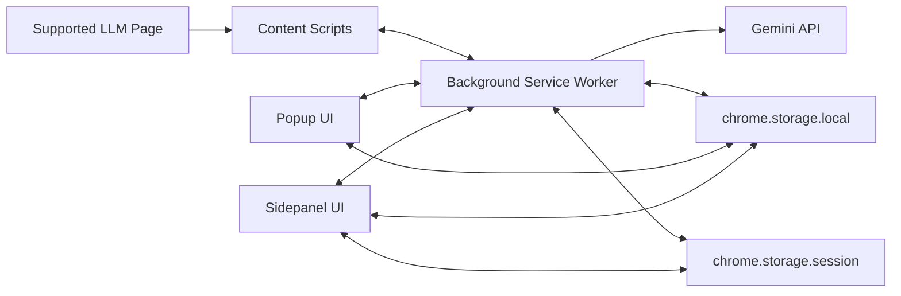

# Promptium Architecture

## High-Level Runtime Model

## Execution Contexts

### Content scripts (`content/`)

Responsibilities:

- Platform lifecycle boot (`content/content.js`)
- Prompt injection (`content/injector.js`)
- Conversation scraping with stable indices (`content/scraper.js`)
- In-page toolbar/FAB actions (`content/toolbar.js`)
- Bookmark controls and persistence (`content/bookmarks.js`)

Key runtime actions handled:

- `injectPrompt`
- `exportChat`
- `openSidePanelAll`
- `scrapeForBridge`
- `getPlatform`

### Service worker (`background/service_worker.js`)

Responsibilities:

- Message routing and cross-context orchestration
- Sidepanel open/payload handoff support
- Gemini API improvement requests
- Allowlisted LLM tab opening (`openLlmTab`) for bridge targets

### Sidepanel app (`sidepanel/`)

Modular composition:

- `app-shell-init.js`: boot, routing, wiring, pending action handling
- `state.js`: shared sidepanel state and onboarding card metadata
- `prompts-ui.js`: prompt list, search, template inject entry, prompts bridge strip
- `template-fill.js`: `{{var}}`/`{{var?}}` parsing and pre-inject form UI
- `export-payload-ui.js`: payload normalization, bookmark reconciliation, preview rendering
- `export-actions-ui.js`: export/copy actions, smart filename use, export bridge strip
- `history-ui.js`, `tags-ui.js`, `settings-ai-ui.js`, `improve-ui.js`, `prompt-form.js`

### Popup app (`popup/`)

Responsibilities:

- Lightweight prompt/history actions
- Onboarding and quick navigation flows

### Shared utilities (`utils/`)

- `bridge.js`: bridge payload build/stage/read, TTL checks, legacy key migration
- `smart-name.js`: deterministic filename generation and extension normalization
- `exporter.js`: format transforms (`markdown`, `txt`, `json`, `pdf`, `notion`, `obsidian`)
- `export-preview-renderer.js`: centralized markdown/code preview rendering helpers
- `session-storage.js`: sidepanel payload snapshot helpers
- `storage.js`, `platform.js`, `ai-bridge.js`, `templates.js`, `dom-helpers.js`

## Storage Contracts

### Persistent (`chrome.storage.local`)

- `prompts`
- `chatHistory`
- `promptiumSettings`
- `promptiumGeminiKey`
- `promptiumImprovePayload`
- `pendingBridge`
- `bookmarks`

Legacy compatibility:

- `pendingContext` is migrated to `pendingBridge` when possible, then removed.

### Session (`chrome.storage.session`)

- `promptiumSidePanelPayload` for export handoff

## Bridge Pipeline

1. Sidepanel requests source conversation (`scrapeForBridge`)
2. `Bridge.buildContextPrompt()` creates bounded context prompt
3. Payload staged under `pendingBridge`
4. Service worker opens allowlisted target tab
5. Target content init checks bridge status:
   - `ready`: inject context into composer
   - `expired`: show expiry toast
6. Payload removed after consume/expiry

## Bookmark Pipeline

1. Content script identifies assistant messages
2. Conversation index resolved from merged DOM order (user + assistant)
3. Bookmark payload stores:
   - `messageIndex`
   - `messagePreview`
   - `messageHash`
4. On render/export, bookmark is valid only when index and hash align
5. Export layer emits `⭐` markers across preview/text formats and PDF text path

## Export Pipeline

1. Selected messages staged via sidepanel payload key
2. Sidepanel normalizes payload and reconciles bookmark metadata
3. Preview rendered according to selected format:
   - Markdown raw/visual paths
   - Notion/Obsidian via shared markdown document renderer
   - JSON code-highlight preview
4. Export actions call `Exporter` transforms
5. Filename resolved by manual name (if set) or `SmartName` fallback order

## Degradation and Safety Rules

- Unsupported pages do not crash feature flows; bridge/bookmark/inject extras remain hidden or no-op
- Semantic and AI flows degrade to deterministic behavior when unavailable
- No destructive storage schema changes; only additive keys
- CSP-safe preview path avoids prohibited HTML-to-PDF/browser-exec patterns
