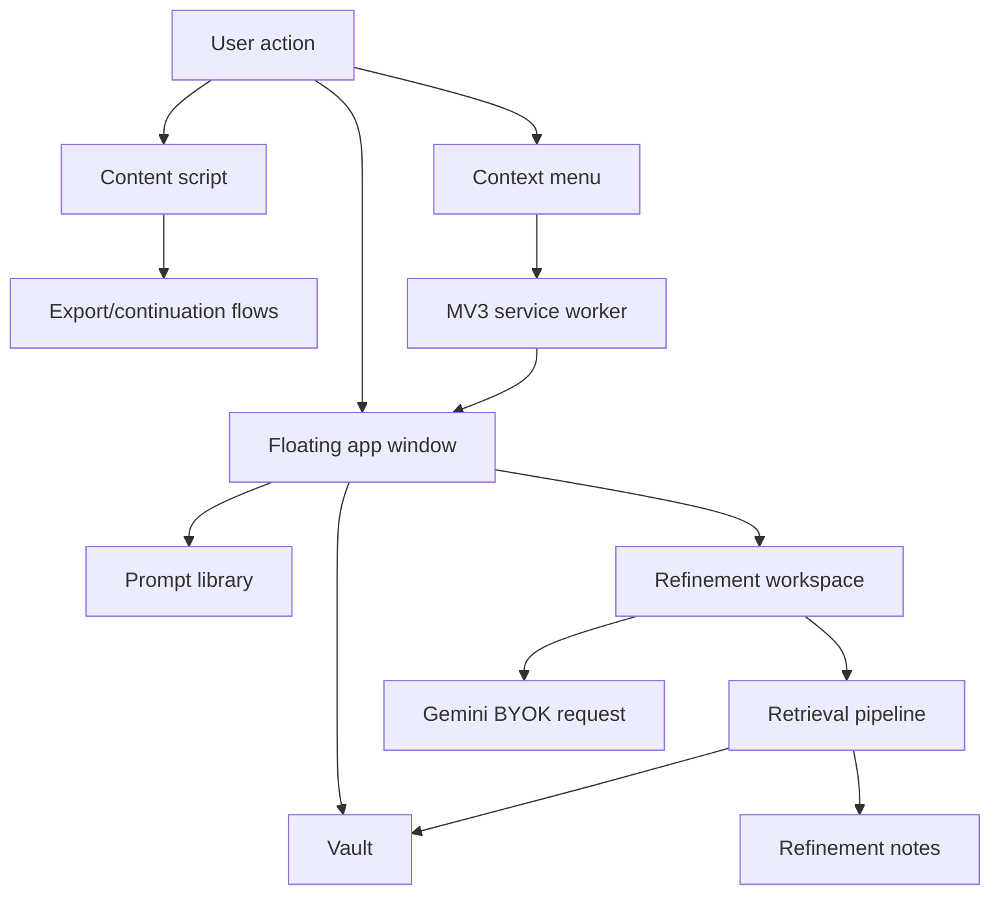

# Architecture Review — F4.5

Generated: 2026-06-23

## Why this architecture exists

Promptium evolved from a side-panel prompt utility into a local-first floating workspace. The architecture now optimizes for four constraints:

1. Chrome MV3 service worker lifecycle.
2. Local-first storage in `chrome.storage`.
3. Gemini-only BYOK AI calls.
4. Fast app-shell startup with feature-level lazy loading.

Those constraints favor a modular browser-extension architecture over a backend-style service architecture. State stays local, expensive intelligence libraries stay behind dynamic imports, and user workflows open through the floating app shell.

## Major subsystems

## Dependency graph

| Layer                           | Depends on                                                | Must not depend on                                         |
| ------------------------------- | --------------------------------------------------------- | ---------------------------------------------------------- |
| `src/core/*`                    | Platform-neutral primitives such as logging.              | Feature modules, DOM-heavy UI, Chrome workflow details.    |
| `src/features/vault/*`          | Vault types/store/importer/UI.                            | Retrieval implementation details, Gemini calls.            |
| `src/features/retrieval/*`      | Vault store/types, notes store, intelligence wrappers.    | UI components, network services, embeddings/vector stores. |
| `src/features/refinement/*`     | Retrieval provider, prompt analysis, Gemini rewrite flow. | Importer UI or prompt-library card internals.              |
| `src/sidepanel/*`               | App-shell orchestration and lazy feature imports.         | Heavy intelligence libraries through static imports.       |
| `src/entrypoints/background.ts` | Window opening, context menu routing, AI message routing. | DOM-only modules.                                          |
| `src/content/*`                 | Page scraping/injection/export bridge.                    | App-window-only UI modules.                                |

## F4.5 consolidation changes

| Change                                | Reason                                                                                 |
| ------------------------------------- | -------------------------------------------------------------------------------------- |
| Added `src/core/logger/`.             | Centralizes production logging without hiding MV3 console visibility.                  |
| Added `src/styles/tokens/index.css`.  | Creates the requested token namespace while preserving the existing foundations files. |
| Removed unused CRE barrel.            | Makes the deprecated retrieval path less visible as public architecture.               |
| Fixed Vault revision storage read.    | Keeps retrieval cache invalidation correct after extension restart.                    |
| Tightened pinned retrieval budgeting. | Preserves F4.1 semantics under large-document and overflow conditions.                 |
| Added F4.5 reports under `docs/`.     | Converts audit findings into repeatable maintenance artifacts.                         |

## Future extension points

| Extension point     | Current contract                                  | Safe future direction                                                                          |
| ------------------- | ------------------------------------------------- | ---------------------------------------------------------------------------------------------- |
| Retrieval providers | `RetrievalProvider.retrieve(query, options)`.     | Add semantic/hybrid providers behind the same interface only if product scope allows it later. |
| Vault health        | Internal `vault-health.ts`.                       | Surface warnings in Vault UI after workflows prove stable.                                     |
| Retrieval profiles  | Deferred.                                         | Persist a small enum setting without exposing ranking internals.                               |
| Logger              | `createLogger(scope)`.                            | Add environment-level filtering or telemetry-free ring buffer for diagnostics.                 |
| Style tokens        | CSS custom properties under `src/styles/tokens/`. | Gradually migrate duplicated component values to tokens.                                       |

## Technical debt backlog

| Priority | Debt                                                                                 | Why it matters                                                                              |
| -------- | ------------------------------------------------------------------------------------ | ------------------------------------------------------------------------------------------- |
| P1       | Retire or fully quarantine old CRE tests/engine.                                     | Two retrieval systems create maintenance ambiguity.                                         |
| P1       | Add dedicated Vault store tests for revision migration and pinned/priority defaults. | Retrieval cache correctness depends on Vault state correctness.                             |
| P2       | Replace remaining production `console.*` calls with `createLogger()`.                | Keeps diagnostics uniform and searchable.                                                   |
| P2       | Add DOM-level tests for Context Used overlay add/remove flows.                       | Source attribution is user-facing and easy to regress visually.                             |
| P2       | Generate bundle reports automatically after production builds.                       | Manual chunk reports drift when hashed filenames change.                                    |
| P3       | Rename residual `sidepanel` source paths after migration.                            | The app behavior is floating-window-first, but folder names still carry historical context. |

## Edge cases

- `sidepanel/` remains a source folder name even though the manifest no longer exposes Chrome `side_panel`.
- The logger cannot use persistent telemetry by design; Promptium is local-first.
- Keeping Gemini-only behavior means provider abstractions should not quietly become multi-provider AI surfaces.
